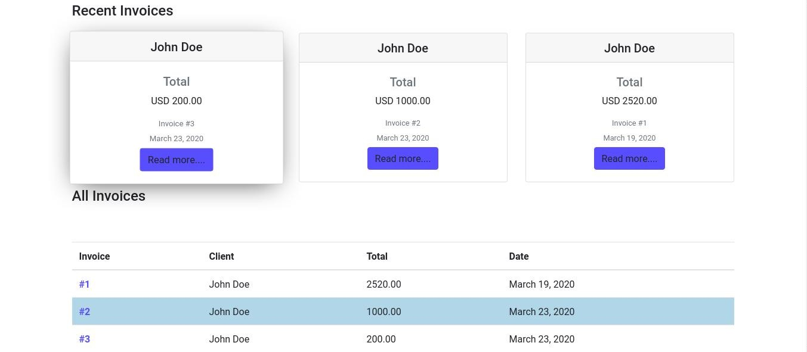
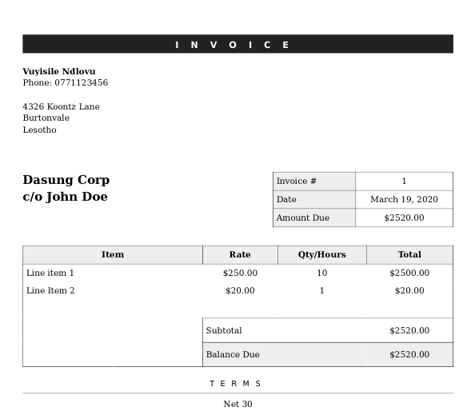

# Invoice Generator

A Django Powered Invoice Generator

## Django Invoice Generator

> A free and simple invoicing solution.

[](https://circleci.com/gh/terrameijar/divio-django-invoice)

This invoice generator is a Django powered online tool to build PDF invoices from your web browser using a ready made template.

## Screenshots

+ Home Page and sample PDF




## Installation

OS X & Linux:

```sh
npm install my-crazy-module --save
```

Windows:

```sh
edit autoexec.bat
```

## Usage example

A few motivating and useful examples of how your product can be used. Spice this up with code blocks and potentially more screenshots.

_For more examples and usage, please refer to the [Wiki][wiki]._

## Development setup

Django invoices runs in a docker container and uses a Postgres 9.x image. Before you can run it, you need to have Docker and Docker-compose installed

+ Install Docker and docker-compose for [your platform](https://docs.docker.com/compose/install/)
+ clone the repo:

    ```sh
    git clone git@github.com:terrameijar/divio-django-invoice.git
    ```

+ Build and run the project:

    ```sh
    docker-compose build
    docker-compose run
    ```

+ To run the automated tests:

    ```sh
    make test
    ```

## Release History

+ 0.0.0
  + Work in progress

## Meta

Vuyisile Ndlovu – [@terrameijar](https://twitter.com/TerraMeijar)
[vuyisile.com](https://vuyisile.com)

Distributed under the *GNU GENERAL PUBLIC LICENSE* license. See ``LICENSE`` for more information.

[https://github.com/terrameijar/](https://github.com/terrameijar/)

## Contributing

1. Fork it (<https://github.com/terrameijar/divio-django-invoice>)
2. Create your feature branch (`git checkout -b feature/fooBar`)

3. Run lint checks

    ```sh
    make lint
    ```

    If lint check fails, make the necessary changes and run the linter again until the lint check passes. If the code needs formatting, run `black`:

    ```sh
    make format
    ```

    When the lint check passes, run the automated tests.

4. Run tests to ensure that your changes didn't break anything:

    ```sh
    make test
    ```

5. Commit your changes (`git commit -am 'Add some feature'`)
6. Push to the branch (`git push origin feature/fooBar`)
7. Create a new Pull Request in GitHub against the `develop` branch.

<!-- Markdown link & img dfn's -->
[npm-image]: https://img.shields.io/npm/v/datadog-metrics.svg?style=flat-square
[npm-url]: https://npmjs.org/package/datadog-metrics
[npm-downloads]: https://img.shields.io/npm/dm/datadog-metrics.svg?style=flat-square
[travis-image]: https://img.shields.io/travis/dbader/node-datadog-metrics/master.svg?style=flat-square
[travis-url]: https://travis-ci.org/dbader/node-datadog-metrics
[wiki]: https://github.com/yourname/yourproject/wiki
